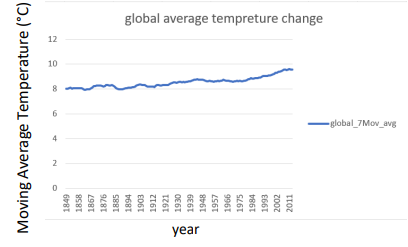

  

<h3 align="center"><a href = "https://www.udacity.com/course/data-analyst-nanodegree--nd002"> Udacity Data Analyst Nanodegree </a></h3>
<h4 align="center">Project I: Explore Weather Trends</h4>

## Table of Contents
- [Project Overview](#project_overview)
- [What Software Do I need?](#what_i_need)
- [Extracting Data](#extracting_data)
- [Data Selection & Manipulation](#data_s&m)
- [Data Visualization](#dv)
- [Observations](#observations)

## Project Overview 
In this project, I will analyze local and global temperature data and compare the temperature trends where I live to overall global temperature trends.

## What Software Do I need? 
To complete this project, i'll require the following softwares:
- SQL
- Excel

## Extracting Data 
To start I wrote an SQL query to retrieve all the temperature data from:
- Local Database (Riyadh)
- Global Database

Upon retrieving the data, it was extracted on a CSV file for further evaluation.

## Data Selection & Manipulation 
Once the data has been extracted on CSV, it was possible to further evaluate the data on Excel. To provide a more accurate and useful dataset for comparison a range of the common years only was chosen.

Moreover, due to fluctuations in yearly averages, the data was evaluated considering moving averages (7-years) to provide smoother results during data visualization. 

## Data Visualization 
Once the dataset was ready, it was time to plug n play. The first chart shows a comparison between the global and local temperature set across the years. 

 

The second plot shows the global average temperature range across all the years to view a trend for the entire dataset. 

 

## Observations 
According to line charts, the following observations may be deduced:
1) Riyadh’s weather is much warmer than the global average considering that
the temperature has always been greater in the past couple hundred years.  
2) Global average temperature for 10 years MA varies between 8.5 °C to 9.5 °C.  
3) Riyadh city average temperature for 10 years MA varies between 24.6°C to 
26.8 °C.  
4) In both cases, we can see that the average temperature is gradually increasing
throughout the entire time-frame.  
5) The yearly average temperature seems to be increasing abnormally on a global
scale in the last 3-4 decades. The same may be noticed when looking at the
wide-range chart in figure 4 where it is evident that the global average
temperature had fluctuated around the 8 C mark up until approximately 
1890.From then on, we notice an uptrend in the temperature rise.  
